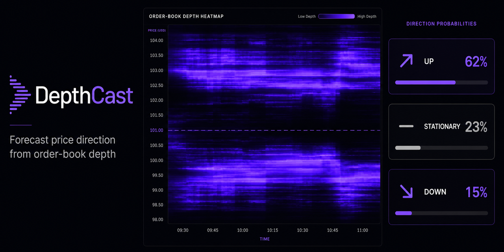
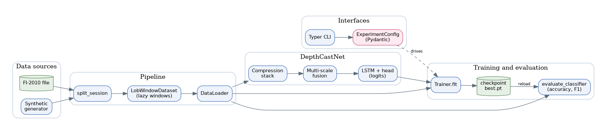

<p align="center"></p>

<div align="center">

# DepthCast

**Forecast short-term price direction from limit-order-book depth.**

[](https://github.com/Hilary-Henshaw/depthcast/actions/workflows/ci.yml)
[](#development)
[](CHANGELOG.md)
[](https://www.python.org/)
[](LICENSE)

</div>

DepthCast is a small, well-typed PyTorch library and command-line tool
that predicts the direction of the next mid-price move from a window of
limit-order-book snapshots. It reimplements the convolutional-recurrent
architecture from the DeepLOB research line as a packaged, tested, and
reproducible tool rather than a notebook.

It is for quantitative researchers, students, and engineers who want a
clean baseline for market-microstructure deep learning that they can read,
test, configure, and extend.

## Contents

- [What it does](#what-it-does)
- [Tech stack](#tech-stack)
- [Architecture](#architecture)
- [Install](#install)
- [Quickstart](#quickstart)
- [CLI reference](#cli-reference)
- [Python API](#python-api)
- [Configuration](#configuration)
- [Data format](#data-format)
- [Design decisions](#design-decisions)
- [Benchmarks](#benchmarks)
- [Development](#development)
- [Known limitations](#known-limitations)
- [Roadmap](#roadmap)
- [Contributing](#contributing)
- [License](#license)

## What it does

Given a window of order-book snapshots (default: 100 consecutive events,
each with 10 price levels of ask/bid price and volume), DepthCast predicts
one of three outcomes for the mid-price at a chosen horizon: **up**,
**stationary**, or **down**.

The network reads each window through:

1. a convolutional **compression stack** that folds the 40-column feature
   axis down to a single column while preserving time,
2. a **multi-scale fusion** module that views the sequence at several
   temporal receptive fields in parallel, and
3. an **LSTM head** whose final hidden state produces three class logits.

No dataset is required to try it: a built-in synthetic generator produces
FI-2010-shaped data on demand, so the whole pipeline runs in seconds on a
CPU.

## Tech stack


## Architecture

DepthCast is organised as a set of single-purpose modules connected by a
thin pipeline. Data flows from a source (FI-2010 file or the synthetic
generator) through windowing into loaders, into the model, and out through
training and evaluation. The CLI and the Pydantic configuration drive the
whole flow.

<p align="center"></p>
<!-- Generated by scripts/architecture_diagram.py -->

See [`docs/architecture.md`](docs/architecture.md) for a layer-by-layer
breakdown of the network.

## Install

DepthCast targets Python 3.11+ and PyTorch 2.2+.

```bash
python -m venv .venv
source .venv/bin/activate            # Windows: .venv\Scripts\activate
pip install -e ".[dev]"              # editable install with dev tools
```

For a runtime-only install, drop the `[dev]` extra. PyTorch wheels vary by
platform and accelerator; if the default wheel does not match your setup,
use the selector at <https://pytorch.org/get-started/locally/>.

## Quickstart

No dataset and no GPU required. The CLI can synthesise an FI-2010-shaped
session, train on it, and evaluate the result:

```bash
# 1. Inspect the model the default config builds.
depthcast summary

# 2. Train on synthetic data (writes checkpoints/best.pt).
depthcast train --synthetic --synthetic-events 8000

# 3. Evaluate the best checkpoint on a fresh synthetic session.
depthcast evaluate --checkpoint checkpoints/best.pt --synthetic
```

## CLI reference

DepthCast installs a `depthcast` console script (also runnable as
`python -m depthcast`). Every command supports `--help`.

| Command | Purpose |
|---|---|
| `depthcast init-config [PATH]` | Write a default YAML configuration. |
| `depthcast synth` | Generate a synthetic FI-2010-shaped session. |
| `depthcast summary` | Print the architecture and parameter count. |
| `depthcast train` | Train a model and checkpoint the best epoch. |
| `depthcast evaluate` | Score a checkpoint and print a report. |

Full option-by-option reference: [`docs/cli.md`](docs/cli.md).

## Python API

```python
from depthcast import DepthCastNet, ExperimentConfig
from depthcast.data import generate_lob_matrix
from depthcast.pipeline import make_loader, matrix_to_dataset, split_session
from depthcast.training import Trainer

config = ExperimentConfig()
config.train.epochs = 5

matrix = generate_lob_matrix(num_events=8000, seed=0)
train_matrix, val_matrix = split_session(matrix, val_fraction=0.2)

train_loader = make_loader(
    matrix_to_dataset(train_matrix, config.data), config.data, shuffle=True
)
val_loader = make_loader(
    matrix_to_dataset(val_matrix, config.data), config.data, shuffle=False
)

trainer = Trainer.build(config)
history = trainer.fit(train_loader, val_loader)
best = max(history, key=lambda report: report.val_accuracy)
```

For inference from a saved checkpoint:

```python
import torch
from depthcast.training import load_checkpoint

loaded = load_checkpoint("checkpoints/best.pt")
window = torch.randn(1, 1, loaded.config.data.window, 40)
probabilities = loaded.model.predict_proba(window)   # rows sum to 1
```

## Configuration

Every tunable lives in three Pydantic models under one `ExperimentConfig`,
which round-trips to YAML. Generate a starter file with
`depthcast init-config` and edit it:

```yaml
data:
  window: 100
  horizon_index: 4       # predict the 100-event horizon
  num_features: 40
  batch_size: 64
model:
  conv_channels: 32
  fusion_channels: 64
  lstm_hidden: 64
train:
  epochs: 50
  learning_rate: 0.0001
  early_stop_patience: 10
  device: auto           # auto | cpu | cuda
  checkpoint_dir: checkpoints
```

Validation is strict: mismatched feature counts, windows too short for the
convolutional stack, unknown log levels, and unexpected keys are all
rejected with a clear message before training starts. Every field is
documented in [`docs/training.md`](docs/training.md).

## Data format

DepthCast reads the FI-2010 benchmark layout: a dense numeric matrix whose
**rows are features and columns are order-book events**. The first 40 rows
are the depth snapshot (10 levels of ask price, ask volume, bid price, bid
volume) and the last 5 rows are direction labels, one per horizon.

| Horizon (events) | `horizon_index` | Classes (after decoding) |
|---|---|---|
| 10, 20, 30, 50, 100 | 0, 1, 2, 3, 4 | 0 = up, 1 = stationary, 2 = down |

Raw FI-2010 labels are one-based and decoded to zero-based class indices,
with validation that every label lands in range. The full layout is
documented in [`docs/data_format.md`](docs/data_format.md).

## Design decisions

A few choices differ deliberately from the original reference notebook:

- **Logits, not probabilities.** `forward` returns raw logits so it pairs
  correctly with `CrossEntropyLoss`. The reference applied softmax and
  then cross-entropy, softmaxing twice. Use `predict_proba` when you want
  a distribution.
- **Lazy windowing.** Overlapping windows are sliced on demand from the
  contiguous matrix instead of being materialised, so memory scales with
  the session length, not the window count.
- **Portable, safe checkpoints.** Models are saved as a `state_dict` plus
  a JSON copy of their config and reloaded through PyTorch's
  `weights_only=True` path, never by pickling a class.
- **Derived feature kernel.** The convolution that collapses the price
  levels uses a kernel width of `num_features / 4`, so the model
  generalises beyond the hard-coded value of ten.
- **Reproducible by construction.** `Trainer.build` seeds Python, NumPy,
  and PyTorch before constructing the model, so weight initialisation is
  deterministic for a given config.

## Benchmarks

Throughput and latency of the core model operations. Numbers are
indicative and depend heavily on hardware and thread count; regenerate
them locally with the command below.

```bash
python scripts/benchmark.py | python scripts/inject_readme_section.py --section benchmarks
```

<!-- BEGIN:benchmarks -->
**Model operation latency**

| Operation | Batch | Mean (ms) | p50 (ms) | p95 (ms) | p99 (ms) | Throughput (samples/s) |
|---|---|---|---|---|---|---|
| forward | 1 | 6.39 | 5.89 | 9.51 | 9.86 | 157 |
| forward | 32 | 130.03 | 129.19 | 136.05 | 145.31 | 246 |
| predict_proba | 32 | 141.93 | 139.22 | 157.68 | 190.30 | 225 |

**Lazy windowing**

| Operation | Events | Windows | Build (ms) | Iterate (windows/s) |
|---|---|---|---|---|
| windowing | 20,000 | 19,901 | 17.20 | 87,702 |

_Measured on CPU, 1 thread, window 100, default model (32 conv / 64 fusion channels). Indicative only; rerun on your own hardware._
<!-- END:benchmarks -->

## Development

```bash
ruff check .            # lint
ruff format --check .   # formatting
mypy                    # static types (strict)
pytest --cov            # tests with coverage (currently 98%)
```

Non-obvious local notes:

- Editable installs use hatchling; if `pip install -e .` complains about a
  missing `editables` package on an offline machine, add `src/` to
  `PYTHONPATH` instead and run `python -m depthcast`.
- On a CPU-only host, cap threads (`torch.set_num_threads(1)`) and lower
  `conv_channels` / `fusion_channels` for quick experiments; the defaults
  are tuned for a GPU.
- Progress is emitted through structured logging on stderr; final results
  go to stdout.

## Known limitations

- **Research artifact, not trading advice.** DepthCast carries no
  performance guarantee and must not be the sole basis for any financial
  decision.
- **Synthetic data is for plumbing, not accuracy.** The generator exercises
  the pipeline; its numbers say nothing about real-market performance.
- **CPU training is slow at default size.** Reproducing published FI-2010
  results needs the full dataset and a GPU.
- **Class imbalance.** Real order-book data is dominated by the stationary
  class; consider class weighting before serious training.

## Roadmap

- Multi-horizon training that predicts every FI-2010 horizon jointly.
- Optional attention pooling over the recurrent outputs.
- A streaming inference helper for live order-book feeds.

## Contributing

Contributions are welcome. Please read
[`CONTRIBUTING.md`](CONTRIBUTING.md) for the development setup and quality
gates, and [`CODE_OF_CONDUCT.md`](CODE_OF_CONDUCT.md) for community
expectations. Security reports go through [`SECURITY.md`](SECURITY.md).

## License

Released under the [MIT License](LICENSE). DepthCast is an independent
reimplementation for research and education; it is not investment advice.
